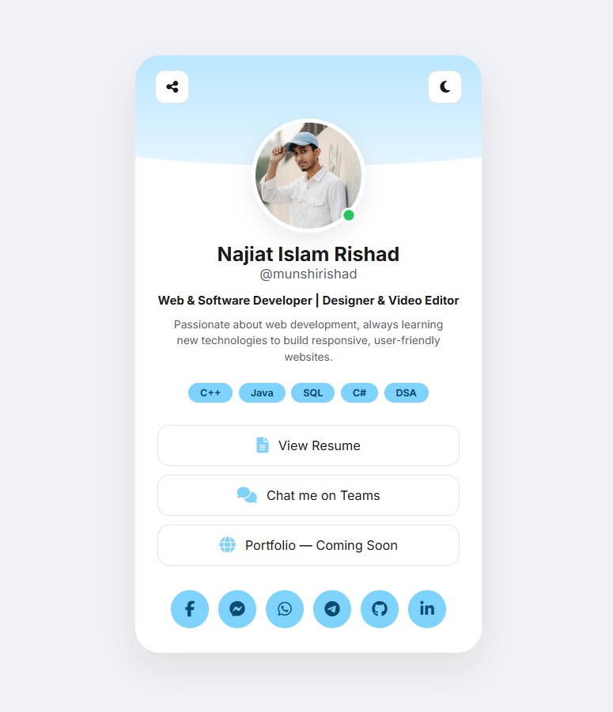

# Pocket Profile Card

I’ve created a little pocket card using HTML, CSS, and JavaScript! This single card holds all my social media platforms in one place. You can directly DM me from any platform! It also includes my introduction, details, and even my CV. 😃

## Features

- All social media links
- Direct messaging from the card
- Personal introduction and details
- CV/Resume access

## How to Use

1. Open the card in your browser.
2. Click on any social media icon to visit or message.
3. View resume directly from the card.
Feel free to explore and contact me anytime!

